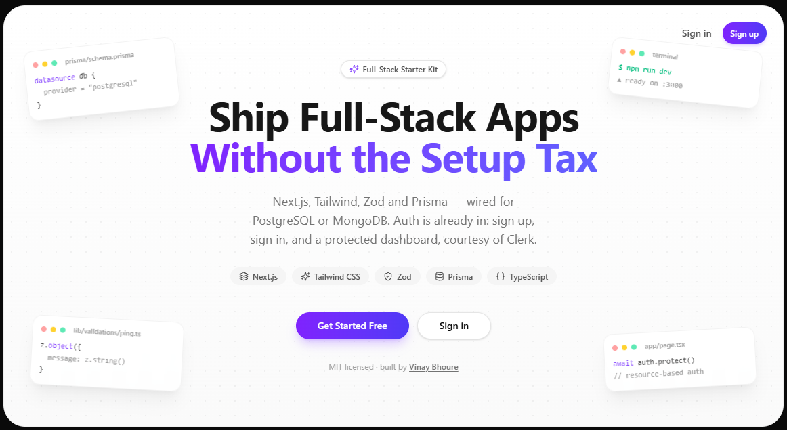

<div align="center">

# Full-Stack Starter Kit

**Next.js · Tailwind · shadcn/ui · Zod · Clerk · Prisma — wired for PostgreSQL**

Clone it, drop in a connection string, and start building. No boilerplate to rewrite.




</div>

## Why this exists

Every new project starts the same way: wire up Next.js, Tailwind, a validation layer, an ORM, and
a database — before writing a single feature. This kit does that once, well, so cloning it is the
setup step.

## Stack

| Layer          | Choice                                                             |
| -------------- | ------------------------------------------------------------------- |
| Framework      | [Next.js 16](https://nextjs.org) (App Router, TypeScript) — frontend + backend in one app |
| Styling        | [Tailwind CSS v4](https://tailwindcss.com)                          |
| UI components  | shadcn-style primitives in `src/components/ui` (Button, Card, Badge, Input), ready for `npx shadcn add` |
| Validation     | [Zod](https://zod.dev)                                              |
| ORM            | [Prisma](https://www.prisma.io) |
| Database       | PostgreSQL ([Neon](https://neon.tech)) |
| Notifications  | [sonner](https://sonner.emilkowal.ski) toasts + [lucide-react](https://lucide.dev) icons |
| Auth           | [Clerk](https://clerk.com) — sign-in/sign-up, session handling, and route protection built in |
| Email          | [Resend](https://resend.com) + [React Email](https://react.email) — ready-to-call templates, not wired to auto-fire |
| Backend layer  | `src/server/{config,controllers,routers,middleware}` — API routes stay thin |

## Quick start

```bash
git clone https://github.com/vinayBhoure/starter-kit.git
cd starter-kit
npm install
```

`npm install` copies the right Prisma schema and runs `prisma generate` automatically. You still
need a `DATABASE_URL` (below) and a pair of Clerk keys (see [Authentication](#authentication))
before everything works end to end — the app boots without them, but the DB check and sign-in
won't.

```bash
npm run dev
```

Open [http://localhost:3000](http://localhost:3000). You'll land on the page above.

## Database setup

The app uses PostgreSQL through Prisma. The schema lives in `prisma/schema.prisma`.

1. Copy the example env file:
   ```bash
   cp .env.example .env
   ```
2. Set `DATABASE_URL` (Neon: dashboard → your project → **Connect** → **Prisma** tab).
3. Apply the schema:
   ```bash
   npm run db:push
   ```
   `npm install` runs `prisma generate` automatically.
4. Check the connection: `curl localhost:3000/api/health` returns `{"ok":true}` (200), or
   `{"ok":false}` (500) if the database is unreachable.

## Authentication

Auth is wired in with [Clerk](https://clerk.com) — sign-up, sign-in, and a protected route are
already there, nothing to build.

| Route          | Access             | What's there                                      |
| -------------- | ------------------ | -------------------------------------------------- |
| `/`            | Public             | Landing page                                       |
| `/login`       | Public             | `<SignIn />`                                        |
| `/signup`      | Public             | `<SignUp />`                                        |
| `/app`         | Signed-in only     | Welcome page                                       |
| `/app/admin`   | `role: "admin"` only | Example role-gated page (see below)               |

**Setup:**

1. Create a free app at [dashboard.clerk.com](https://dashboard.clerk.com) → **API keys**.
2. Add them to `.env`:
   ```bash
   NEXT_PUBLIC_CLERK_PUBLISHABLE_KEY=...
   CLERK_SECRET_KEY=...
   ```
3. `npm run dev` and visit `/signup` — you'll land on `/app` afterwards.

`src/proxy.ts` (Next.js 16 renamed `middleware.ts` to `proxy.ts`) only wires up
`clerkMiddleware()` — it does **not** gate routes. Clerk deprecated middleware-based route
matching (`createRouteMatcher`) because path-based checks can be bypassed — Server Actions are
invoked by ID rather than by URL, and regex-to-route mapping can have gaps. The recommended fix is
**resource-based auth checks**: each protected page calls `await auth.protect()` itself. That's
what `src/app/app/page.tsx` and `src/app/app/admin/page.tsx` do — open either file to see the
pattern to copy for your own protected pages, routes, or Server Actions.

**No local `User` table.** Clerk is the source of truth for identity. Anywhere you need to know
who's signed in, call `auth()` (server) — you get a `userId` string, which is all you need to
attach app data to a user later:

```prisma
model Post {
  id       String @id @default(cuid())
  title    String
  authorId String // Clerk's userId — plain string, no foreign key
}
```

If you later want users queryable/joinable in your own database (an admin table, reporting,
extra fields Clerk doesn't have), sync one with a webhook — see
[Clerk's guide](https://clerk.com/docs/webhooks/sync-data) — but that's an intentional upgrade,
not something this kit assumes you need.

### Adding role-based access

Roles live in Clerk's `publicMetadata`, not the database — no schema, no webhook. This kit
already ships the plumbing (`types/globals.d.ts` and the `/app/admin` example, which checks
`sessionClaims.metadata.role` directly in the page); you just need to turn it on:

1. **Clerk Dashboard → Sessions → Customize session token** — add:
   ```json
   { "metadata": "{{user.public_metadata}}" }
   ```
2. **Clerk Dashboard → Users → pick a user → Public metadata:**
   ```json
   { "role": "admin" }
   ```
3. Visit `/app/admin` signed in as that user — anyone else is redirected back to `/app`.

To check a role anywhere else in the app (another server component, a server action, a route
handler), the pattern is always the same — call `auth.protect()` first for the base sign-in
check, then inspect the claim:

```ts
await auth.protect(); // require sign-in
const { sessionClaims } = await auth();
if (sessionClaims?.metadata?.role !== "admin") { /* redirect, or return "Not authorized" */ }
```

`types/globals.d.ts` defines the `Roles` union (`"admin" | "moderator"` by default) — extend it
with whatever roles your app needs.

## Email

Transactional email via [Resend](https://resend.com), with templates written as
[React Email](https://react.email) components. This covers email flows Clerk itself
doesn't handle — Clerk's hosted auth UI already sends verification codes, magic
links, and password resets, so this stays out of Resend's way entirely.

Setup:

1. Create a free account at [resend.com](https://resend.com) and grab an API key from
   **API Keys**.
2. Set `RESEND_API_KEY` and `EMAIL_FROM` in `.env`. Without a verified sending domain,
   Resend restricts you to sending from `onboarding@resend.dev` to your own account
   email only (its sandbox mode) — fine for local development.
3. Call `sendEmail()` wherever you need it:

   ```ts
   import { sendEmail } from "@/lib/send-email";

   await sendEmail("user@example.com", "welcome", { name: "Ada" });
   ```

That's the whole surface area. There's no email preview server and nothing fires
automatically — `sendEmail()` is a plain function you call explicitly, for example
inside a Server Action after your own signup logic runs.

**Adding a new template:**

1. Create `src/emails/templates/<name>.tsx` exporting a React Email component.
2. Register it in the `templates` map in `src/lib/send-email.ts` and give it a
   subject line in the `subjects` map right below it.

`sendEmail()` picks up the new template automatically, fully typed against its props.

## Project structure

```
prisma/
  schema.prisma              # Postgres schema
types/
  globals.d.ts               # CustomJwtSessionClaims — the `Roles` union for RBAC
src/
  proxy.ts                   # wires up clerkMiddleware() only — no route gating (see Authentication)
  app/
    page.tsx                       # landing page
    login/[[...login]]/page.tsx    # <SignIn />
    signup/[[...signup]]/page.tsx  # <SignUp />
    app/page.tsx                   # protected via auth.protect()
    app/admin/page.tsx             # protected via auth.protect() + role check
    api/health/route.ts            # GET health check (SELECT 1)
  components/
    ui/                       # shared UI primitives (Button, Card, Badge, Input)
  config/
    db.ts                     # Prisma client singleton
    resend.ts                 # Resend client singleton
    env.ts                    # central place to read server-side env vars
  lib/
    send-email.ts             # sendEmail() — typed wrapper around Resend + templates
    utils.ts                  # cn() helper
    validations/              # Zod schemas
  emails/
    templates/
      welcome.tsx              # post-signup welcome email (React Email)
  server/
    controllers/               # business logic
    routers/                   # validate -> controller -> response
    middleware/                 # Zod body-validation helper
```

## Adding your own features

1. Add a model to `prisma/schema.prisma`, then `npm run db:push`.
2. Add a Zod schema in `src/lib/validations/`.
3. Add a controller in `src/server/controllers/`, a router in `src/server/routers/`, and a route
   file under `src/app/api/.../route.ts` — following the `health.*` pattern.
4. Need a new UI primitive? `npx shadcn add <component>` — `components.json` is already set up.

## License

MIT — see [LICENSE](LICENSE). Built by [Vinay Bhoure](https://vinaybhoure.xyz).
