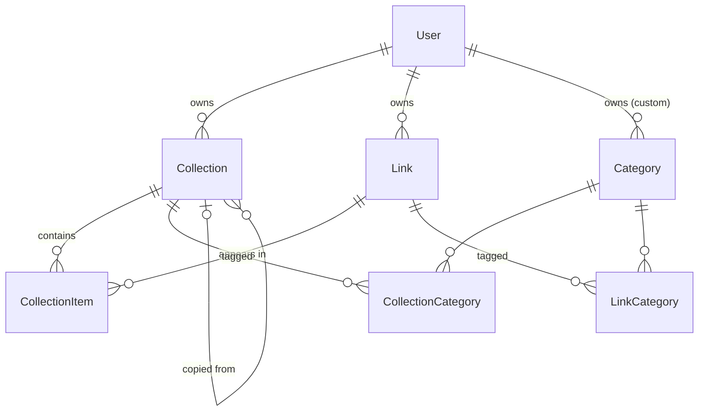

# Data Model

## Table of Contents
1. [Entity diagram](#1-entity-diagram)
2. [Models](#2-models)
3. [Invariants](#3-invariants)
4. [Delete behaviour](#4-delete-behaviour)
5. [Queries and indexes](#5-queries-and-indexes)

Status: **Built** (migration `20260923191101_init`; `Collection.publicId` added in `20260926021155_add_collection_public_id_nullable` + `20260926021656_require_unique_collection_public_id`, plan 6 C3.1). Field-level schema: `prisma/schema.prisma`; plan: `docs/implementation-plan/1_backend-mvp.md` §4. Update this file with every migration.

---

## 1. Entity diagram

---

## 2. Models

| Model | Purpose | Key constraints |
|---|---|---|
| `User` | App profile tied to a Clerk account | `clerkId` unique, `username` unique |
| `Collection` | Named, ordered list of links | `(userId, slug)` unique; `publicId` unique (6-char `[a-z0-9]`, C3.1); `visibility` default `PRIVATE`; `sourceCollectionId` → `SetNull` |
| `Link` | One saved URL + its metadata, shared by all collections that hold it | `(userId, normalizedUrl)` unique |
| `CollectionItem` | Places a link in a collection at a position | `(collectionId, linkId)` unique |
| `Category` | System (`userId = null`) or custom (`userId` set) label | `(userId, slug)` unique |
| `CollectionCategory`, `LinkCategory` | Many-to-many category joins | composite primary key |

---

## 3. Invariants

Enforced in controllers unless marked DB.

| # | Rule | Enforced in |
|---|---|---|
| I1 | A user has at most one `Link` per `normalizedUrl` | DB unique + `createLink`, `copyCollection` |
| I2 | Every `Link` has ≥ 1 `CollectionItem` | `removeLinkFromCollection`, `deleteCollection` (same transaction) |
| I3 | A link appears once per collection | DB unique + `createLink`, `moveLink` |
| I4 | Items are read in `position` order; reorder rewrites `0..n-1`; gaps after removal are allowed | `reorderCollectionItems` |
| I5 | Collection slug unique per user; collisions get `-2`, `-3` | DB unique + `uniqueSlug` |
| I6 | Items attach only system categories or the owner's own, max 5 | collection/link actions |
| I7 | Custom category name ≠ any system name or the user's other names (case-insensitive) | `createCategory` |
| I8 | A `User` row exists only after onboarding; username lowercase, not reserved | `completeOnboarding`, `updateProfile` |
| I9 | System categories are seeded, never edited or deleted by the app | `prisma/seed.ts`, `deleteCategory` (own only) |
| I10 | Every `Collection` has a unique `publicId` (6-char `[a-z0-9]`), assigned at creation and never changed by rename or slug change | DB unique + `uniquePublicId` in `createCollection`, `copyCollection` |

---

## 4. Delete behaviour

| Deleted | DB cascade | App follow-up (same transaction) |
|---|---|---|
| `User` | collections, links, custom categories, and their items/joins | — (Clerk deletion is not synced in MVP) |
| `Collection` | items, collection-category joins; copies' `sourceCollectionId` → `null` | delete the user's links left with zero items (I2) |
| `Link` | items, link-category joins | — |
| `CollectionItem` (remove) | — | delete the link if zero items remain (I2) |
| Custom `Category` | both join tables | — |

---

## 5. Queries and indexes

| Query | Index used |
|---|---|
| My collections | `Collection @@index([userId])` |
| Collection items in order | `CollectionItem @@index([collectionId, position])` |
| Public profile by URL | `User.username` unique |
| Public collection by URL | `Collection.publicId` unique (C3.1); stale `username`/`slug` in the URL redirect to the current one |
| Duplicate URL check | `Link @@unique([userId, normalizedUrl])` |
| Explore category filter | `CollectionCategory @@index([categoryId])`, `Collection @@index([visibility])` |
| Search (`contains`, case-insensitive) | None: `ILIKE '%q%'` scans. Accepted for MVP; check with `EXPLAIN` in `4_polish-mvp.md` Q8. `%`, `_` and `\` in `q` are escaped (`escapeLike`) so they match literally |
