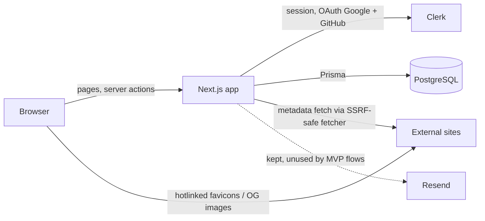

# Architecture Overview

## Table of Contents
1. [Status legend](#1-status-legend)
2. [System context](#2-system-context)
3. [Layers](#3-layers)
4. [Request flows](#4-request-flows)
5. [Code layout](#5-code-layout)

---

## 1. Status legend

- **Built**: exists in the repo today.
- **Planned**: defined in `docs/implementation-plan/*`, not in code yet.

Update this file in the same commit as any change to layers, flows or folders.

---

## 2. System context



One Next.js app. No separate backend, no Redis, no queues, no object storage.

---

## 3. Layers

| Layer | Location | Does | Must not | Status |
|---|---|---|---|---|
| Proxy | `src/proxy.ts` | Runs `clerkMiddleware()` so Clerk session is available | Gate routes | Built |
| Pages / layouts | `src/app/**` | Check auth, call queries, render, `generateMetadata` | Import Prisma or controllers | Built (starter) |
| Client components | `src/components/**`, `src/hooks/**` | Forms, UI state, call server actions | Import server-only modules | Built (primitives) |
| Server actions | `src/server/actions/` | Resolve user → Zod → controller → `revalidatePath` → `ActionResult` | Hold business rules or call Prisma | Planned |
| Controllers | `src/server/controllers/` | Business rules, owner-scoped writes, `$transaction` | Read the user ID from input | Built (health only) |
| Queries | `src/server/queries/` | Reads for pages; public queries filter `PUBLIC` | Write | Planned |
| Metadata | `src/server/metadata/` | SSRF-safe fetch + HTML parse | Be called outside `createLink` | Built |
| Route handlers | `src/app/api/*` → `src/server/routers/` → controllers | HTTP endpoints (only `/api/health` in MVP) | Replace server actions for app mutations | Built |
| Shared | `src/lib/` | Zod schemas, URL/slug/username helpers, utils | Import server-only code | Built (utils) |
| Config | `src/config/` | Prisma client, env, Resend client | — | Built |

Dependency direction: `app → actions → controllers → config/db` and `app → queries → config/db`. `lib` is used by all layers and imports none of them.

---

## 4. Request flows

### 4.1 First sign-in
1. User signs in at `/login` or `/signup` (Clerk) → redirected to `/app`.
2. App shell layout: `auth.protect()` → `getCurrentUser()` returns `null` → redirect `/app/onboarding`.
3. `completeOnboarding` creates the `User` row (`clerkId`, username, Clerk avatar URL) → `/app`.

### 4.2 Mutation (every server action)
1. Client form: shared Zod `safeParse` → call action in `startTransition`.
2. Action: `requireOnboardedUser()` → Zod parse → controller.
3. Controller: load records with `where: { id, userId }` → write (multi-row in `$transaction`).
4. Action: `revalidatePath(...)` → return `ActionResult`.
5. Client: inline field errors or toast.

### 4.3 Add link
1. `createLink` → rate limit → `normalizeUrl`.
2. Link with same `(userId, normalizedUrl)` exists → add `CollectionItem` only (or `CONFLICT` if already in this collection).
3. New URL → `getMetadata` (never throws) → transaction: create `Link` + `CollectionItem` at end of list.

### 4.4 Public page
1. `/{username}/{slug}` → `getPublicCollection` (wrapped in React `cache()` for page + metadata).
2. Query filters `visibility: PUBLIC` → `null` → `notFound()` (404, same as missing).

---

## 5. Code layout

```text
prisma/
  schema.prisma                 Built (MVP models, B2.1)
  migrations/                   Built (init)
  seed.ts                       Built (system categories, B2.2)
src/
  proxy.ts                      Built
  app/
    layout.tsx, globals.css     Built: Quiet Index tokens, Geist fonts, ThemeProvider, root metadata (F1.1, F2.1)
    sitemap.ts, robots.ts       Planned
    not-found.tsx, error.tsx    Built (F2.1)
    (public)/                   Built: layout (header, footer, skip link), / (landing, F4.1) , error, /[username] (F4.2), /[username]/[slug] (F4.3), /explore (F4.4)
    login/, signup/             Built
    app/
      onboarding/               Built (F3.1): OnboardingForm, live username check
      admin/                    Built (kept)
      (shell)/                  Built: layout (auth + onboarding redirect, AppHeader, noindex), loading, error, not-found, /app (collections list, F3.2), collections/[id] header + links (F3.3–F3.4), search (F3.5), settings (F3.6)
    api/health/                 Built
  components/ui/                Built: shadcn primitives (plan 2 §4.5), retuned to tokens (F1.2)
  components/                   Built: theme, wordmark, skip-link, public-header, site-footer, app-header, app-nav, app-mobile-menu, app-search-form, onboarding-form, collection-form-dialog (create + edit), category-picker, collection-menu, public-link-bar, local-date, page-header, empty/error state, submit/copy/share buttons, favicon, visibility-badge (F1.1–F1.3) → link-row, collection-row, public-collection-row, save-collection-button, add-link-form, confirm-dialog, profile-form, category-settings, appearance-select, collection-links, link-edit-dialog, move-link-dialog, form-field (F3.4)
  hooks/                        Built: use-action-form (F1.3)
  lib/
    utils.ts                    Built
    validations/                Built (username) → Planned: other MVP schemas
    url/normalize.ts, slug.ts, reserved-usernames.ts   Built (B3.3)
    url/ensure-scheme.ts        Built (F1.3, FD4)
  server/
    auth/current-user.ts        Built (B3.1; requirePageUser + cached getCurrentUser, F3.2)
    actions/                    Built: profile.ts (B4), category.ts (B5), collection.ts (B6), link.ts (B8), copyCollection (B11)
    queries/                    Built: categories.ts (B5), collections.ts (B6), search.ts (B9), public.ts (B10)
    metadata/                   Built: fetch.ts, parse.ts (B7)
    controllers/, routers/, middleware/    Built (health, profile, category, collection, link, copy, validate)
    result.ts                   Built: AppError, ActionResult, toActionResult (B3.1–B3.2)
    rate-limit.ts               Built (B3.2)
    unique-slug.ts              Built (B3.3; queries DB, so not in lib/)
    revalidate.ts               Built: revalidateCollectionPaths, revalidateCollections (B8)
  config/                       Built: db, env, resend
  emails/templates/             Built (kept)
```
